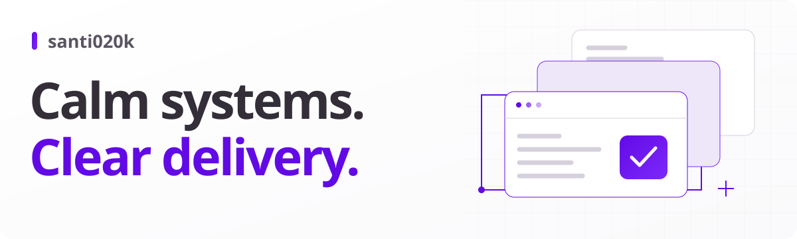

<picture>
  <source media="(prefers-color-scheme: dark)" srcset="./assets/profile-dark.svg" />
  
</picture>

# Santiago Molina

**Engineering leader · Full-stack architect · Product builder**\
Medellín, Colombia · Working with teams worldwide

I help teams modernize systems, improve developer experience, and ship with confidence. Since 2014, my work has spanned commerce, sports media, esports, developer tools, and native apps. I stay close to the code while helping teams make clearer technical decisions.

**[Website](https://santi020k.com/)** · **[Résumé](https://santi020k.com/resume/)** · **[LinkedIn](https://linkedin.com/in/santi020k)** · **[Email](mailto:hi@santi020k.com)**

[Selected work](#selected-work) · [Developer tools](#developer-tools) · [Products](#products) · [Writing](#writing) · [Community](#community)

## Selected work

**[Void.GG — technical leadership](https://santi020k.com/portfolio/void/)**\
Led architecture and delivery across web, mobile, backend, and real-time esports systems. Improved performance and deployment workflows while helping a 14-person team deliver.

**[X Games — full-stack engineering](https://santi020k.com/portfolio/xgames/)**\
Built live-stream access controls, geo-aware experiences, and Google Ad Manager integrations for a sports media platform with demanding event windows.

**[Smith Commerce — storefront modernization](https://santi020k.com/portfolio/smith-commerce/)**\
Rebuilt Marcone’s storefront around headless commerce, performance, and accessibility, with modular boundaries that let teams work independently.

**[Optic Power / Codepwr — product engineering](https://santi020k.com/portfolio/optic-power/)**\
Shipped across gaming and SaaS products, including Team Liquid, NurtureBoss, and Stardust.gg, with work spanning APIs, frontend architecture, and performance.

[Explore my experience →](https://santi020k.com/work/)

## Developer tools

I build tools around problems I encounter in my own projects: consistent interfaces, useful feedback, and dependable delivery.

| Project | What it helps with |
| :--- | :--- |
| **[Lumen UI](https://github.com/santi020k/lumen)** | Accessible components and shared design foundations for Astro, React, Web Components, and native interfaces. [Explore →](https://lumen.santi020k.com/) |
| **[Astro Doctor](https://github.com/santi020k/astro-doctor)** | Diagnostics for performance, accessibility, security, and Astro best practices, in the editor and CI. [Explore →](https://doctor.santi020k.com/) |
| **[Quality](https://github.com/santi020k/quality)** | One predictable command to run the right code-quality tools across languages and platforms. [Explore →](https://quality.santi020k.com/) |
| **[ESLint Config Basic](https://github.com/santi020k/eslint-config-basic)** | JavaScript and TypeScript flat configs with framework detection and focused integrations. [Explore →](https://eslint.santi020k.com/) |
| **[Dep Beacon](https://github.com/santi020k/dep-beacon)** | Dependency versions, update guidance, and OSV vulnerability signals inside VS Code and Zed. [Explore →](https://beacon.santi020k.com/) |
| **[Santi020k Theme](https://github.com/santi020k/santi020k-theme)** | A shared violet palette for editors, terminals, browsers, and web interfaces. [Explore →](https://theme.santi020k.com/) |

Also building [Commitprompt](https://github.com/santi020k/commitprompt) for Conventional Commits, [OG](https://github.com/santi020k/og) for social images, and [Auth](https://github.com/santi020k/auth) for reusable authentication policy. [Observatory](https://github.com/santi020k/observatory) brings repository, package, and product signals together in a source-available operations dashboard.

## Products

Personal products give me room to work across the whole experience: design, implementation, accessibility, privacy, and delivery.

- **[PostLens](https://postlens.santi020k.com/)** — A visual content studio for iPhone and iPad, with core photo analysis and editing on device. *SwiftUI · PhotoKit · Vision*
- **[Between Contractions](https://between.santi020k.com/)** — A calm, bilingual contraction timer with native apps, watches, widgets, and optional partner coordination. *SwiftUI · Kotlin · Cloudflare*
- **[RoadScore](https://roadscore.santi020k.com/)** — An offline road-trip card game with a shared scoreboard and private trip journal. *React Native · Expo · TypeScript*
- **[Coolstead](https://coolstead.santi020k.com/)** — A macOS menu-bar app for thermal monitoring and gradual, safety-bounded fan control. *Swift · macOS*

[Browse all projects and case studies →](https://santi020k.com/projects/)

## How I work

- **Stay hands-on.** Connect architecture decisions to the code, the product, and the people maintaining it.
- **Make quality repeatable.** Use tests, accessibility checks, clear documentation, and release automation to shorten feedback loops.
- **Respect the user.** Treat performance, privacy, and understandable interfaces as part of the product.

My core stack is **TypeScript, React, Astro, Node.js, and Cloudflare**. My product work also spans **Swift / SwiftUI, Kotlin / Compose, React Native, and Rust tooling**.

## Writing

I write about the systems I build and the tradeoffs behind them. Start with:

- **[How I Built the santi020k Developer Tool Ecosystem](https://santi020k.com/blog/building-santi020k-developer-tool-ecosystem/)** — How the tools connect across real projects.
- **[Why Developer Experience Work Should Be Measured Like Product Work](https://santi020k.com/blog/why-developer-experience-work-should-be-measured-like-product-work/)** — Making engineering improvements visible.
- **[AI Coding Is Probabilistic. Your Delivery Process Should Not Be.](https://santi020k.com/blog/ai-coding-is-probabilistic-your-delivery-process-should-not-be/)** — Why fast code generation still needs dependable verification.

### Latest on Medium

<!-- BLOG-POST-LIST:START -->
<ul>
  <li><a href="https://medium.com/@santi020k/why-i-moved-from-vs-code-based-editors-to-zed-da3acbf0ee66">Why I Moved from VS Code-Based Editors to Zed</a> · Sep 07, 2026</li>
  <li><a href="https://medium.com/@santi020k/why-i-built-between-contractions-d8bd87cfc018">Why I Built Between Contractions</a> · Aug 20, 2026</li>
  <li><a href="https://medium.com/@santi020k/astro-and-alpine-patterns-for-fast-content-heavy-sites-d8cfc533ac72">Astro and Alpine Patterns for Fast Content-Heavy Sites</a> · Aug 14, 2026</li>
</ul>
<!-- BLOG-POST-LIST:END -->

[All articles on my website](https://santi020k.com/blog/) · [Follow on Medium](https://medium.com/@santi020k)

## Community

I’ve helped co-organize **[ReactJS Colombia](https://santi020k.com/portfolio/react-js-colombia/)** since 2017, through meetups, workshops, and mentorship. I speak about frontend architecture, developer experience, and engineering leadership.

**Surviving Technical Interviews in React** · ReactJS Medellín, 2024\
[Watch the talk](https://www.youtube.com/watch?v=UtBZP93cOUs) · [Browse the slides](https://interviews.santi020k.com/1) · [More talks and workshops](https://santi020k.com/speaking/)

## Let’s build something useful

Have a team that needs hands-on technical leadership, a platform to modernize, or a developer workflow to improve? I’d like to hear what you’re working on.

**[hi@santi020k.com](mailto:hi@santi020k.com)** · [Connect on LinkedIn](https://linkedin.com/in/santi020k) · [santi020k.com](https://santi020k.com/)
